# CamundaHalloween

It's a very Camunda Halloween, and this project should keep you safe from the
Trick-or-Treaters!

It's more than just a BPM process, of course. It's an IoT project that uses
Camunda BPM to deliver the goods.


I'll break this post up into several sections, but you will need (or at least need access to) a 3-D printer to fully realize the awesomness here. It uses a modified Dog Treat Dispenser because I didn't have the time (or the skills) to design a whole new Candy Dispenser from scratch.

## Overview

This is both a hardware and a software, as well as a BPMN, project, so there
are a lot of moving parts -- literally and figuratively.

The first thing I had to do was figure out what all those parts would be, and to map it all out.
Luckily, I had [Cawemo](https://www.https://cawemo.com)to get me started. I mapped out all the various parts of the
process there, and asked for feedback (because I could share the Cawemo model with some
collaborators!). Then, once I had the basic overall structure down, I moved it all over
to Camunda Modeler to flesh out the details of the process. This process of defining each
step in the process was very helpful in designing _all_ of the various parts.

So, here's the overall model I came up with (you can get the [complete file](Modeler/costume.bpmn) too):

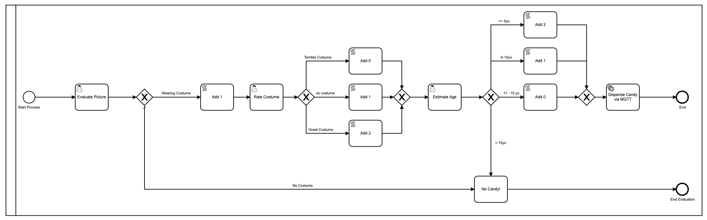

There are some areas where I could simplify things, of course, but this is, after all,
basically a [Rube Goldberg](https://en.wikipedia.org/wiki/Rube_Goldberg_machine) project of sorts,
so simplification wasn't really the goal. The basic steps are:
1. Trick-or-Treater rings doorbell
2. Camera takes a picture of the Trick-or-Treater and sends it to a server
3. User evaluates the picture to determine if the person is wearing a costume
   1. If they are not, they get no candy and the process ends
4. If they are, a piece of candy is added to their virtual candy bag
5. The picture is then evaluated a second time to judge the costume
   1. If the costume is really great, two pieces of candy are added to the virtual candy bag
   2. If the costume is just 'ok' one piece of candy is added
   3. If the costume is terrible, no additional candy is added
6. The picture is then evaluated a third time where the age of the Trick-or-Treater is determined
   1. If the Trick-or-Treater is 5-years-old or under, they get two additional pieces of candy because little kids in cute costumes are the best
   2. If they are 6-10 years old, they get one additional piece of candy added
   3. If they are 11-15 years old, no additional candy is added
   4. If they are 15 years old or older, no candy will be dispensed and the process ends
7. All the candy is added up and sent to the automatic Candy Dispenser where the right number of pieces of candy are given out

Could I have made Halloween candy giving any more complicated? Probably. But I decided not to.

So there you have the overall layout. Next I needed to build the two pieces of hardware that
would allow me to make this dream come true. I needed a doorbell camera, and a treat dispenser.

For those things, I needed to build some custom hardware, and then 3-D print some custom pieces
to make it all come together.

I also had to write a small server process to take the pictures in from the Camera, and then
submit them to the Camunda Engine, as well as an external command that the Camunda Engine
could call at the end, which would start the candy being dispensed. I'll cover each of these
areas in its own section.

## 3-D Printing

With my printer, the printing took the better part of four days, so be prepared for some long days
watching your printer! I only printed the following parts from the included model:
* `treat-spout.stl` -- the spout where the treats come out!
* `hopper.stl` -- the hopper to hold your candy reserves
* `Screwll.stl` -- the screw that turns to dispense candy
* `feeder-tube.stl` -- the tube that the screw goes in
* `Hopper-lid.stl` -- the lid for the hopper

In addition, I did design and print one piece: `TreatHolder.stl` Since I didn't use a
servo motor, but instead opted to use stepper-motor, I had to design a part to hold
the stepper motor and the tube.

All of these files are in the `DispenserFiles` sub-directory. Happy printing!\

Depending on what motor you use to drive the screw, you _may_ have to customize the
hole just a bit to make the shaft fit.

Here's what the inside of the Dispenser looks like. You can see that it uses a screw-mechanism
to push candy along the tube.


And when the whole thing is assembled and ready to dispense candy.

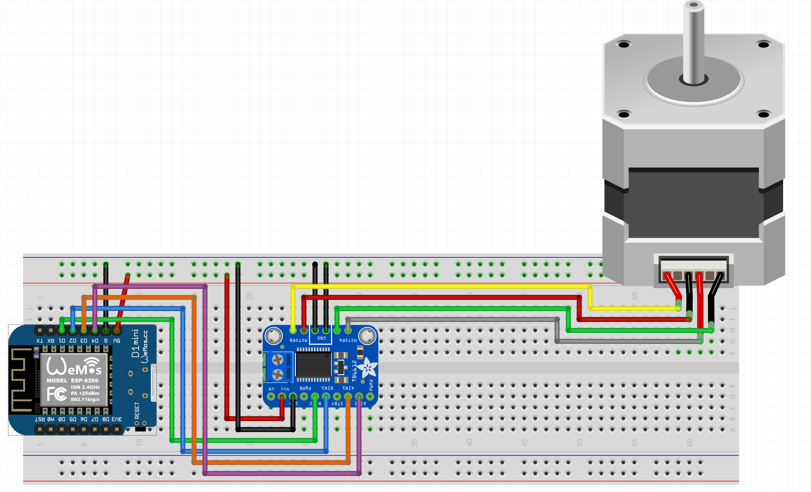

## The Hardware

I probably over-engineered this just a bit. :-) But there are essentially two different hardware builds here:
* Camera and Doorbell
* Treat Dispenser

I'll cover each of these separately, but none of the parts are hard to come by, and most,
if not all, should be available from [Adafruit](https://adafruit.com).

### The Camera and Doorbell

The camera and doorbell is based on the `ESP32-Cam` board which is a small, super cheap
board that has a fairly high quality camera on it. It's about 1" square (that's 2.5cm for those outside the US!)
and has an SD Card slot on it as well as a very bright flash. In addition, I added a momentary switch
(as the 'doorbell') and two LEDs -- a Green and a Red -- as status LEDs in case the board,
or the camera, don't come up correctly.

Here's how I wired it all up:

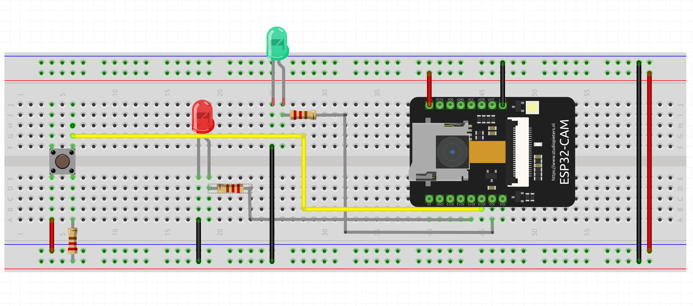

And here's what the final product looks like:


My LEDs needed 100-Ohm resistors in order for them to get bright enough.
The doorbell has a 220-Ohm resistor on it. That's really all there is to it
for the wiring on the Doorbell/Camera side.

Now, on the Code side, there are a few things you'll need. You need to install
the ESP-32 Camera Library for Arduino, which you can get from the Espressif [GitHub](https://github.com/espressif/esp32-camera)
Once you have that, then the code in [CandyCam](CandyCam/CandyCam.ino) should
compile and work just fine.

**Note:** You will have to enter your WiFi SSID and Password on line `125` in order
to connect. You will also need to change the IP address of your server on line `204`.
These are hard-coded in order to save memory space as we are taking large pictures
on a small device.

### The Treat Dispenser

The Treat Dispenser uses a super-cheap Wemos D1 R2 Mini (ESP8266) D1. I buy them in bulk
for about US $1.50 each, so it's ok if they blow up now and then (they do). The Stepper
motor driver is an [Adafruit TB6612](https://www.adafruit.com/product/2448)which is about
US $5.00. The most expensive part of the whole thing is the [stepper motor](https://www.adafruit.com/product/324).

One part that is _not_ shown is the [boost step-up regulator](https://www.pololu.com/product/2117) that I used to bump the input voltage to the motor
from 3.3V to 12V


And here's what that board looked like in its final form:


Finally you'll need the code for the [Candy Dispenser](CandyDispenser/CandyDispenser.ino). Once again,
you'll need to make sure you set the address for your MQTT Broker (line `15`), your
WiFi access point and password (lines `24` & `25`).

## The Software

Now that you have all the hardware built and deployed, you need the software to pull it
all together and make it work. As mentioned before, when the 'doorbell' is pressed,
the Camera snaps a picture, stores it locally, and then sends it out. But where does it
send it?

### The Server Software

I originally tried to write the whole thing in JavaScript, but JavaScript has a memory
limit on incoming file sizes, so since I'm snapping fairly large pictures, I had to write
my own webserver, and I did that using Go.

The Webserver allows me to take in the picture files, stores them, and then serves them up
to the Camunda Task as needed. It also is responsible for initiating the task for each
new picture that comes in.

For that part, I used the Camunda [GoLang library](https://github.com/citilinkru/camunda-client-go).

```go
// sendPic sends the picture to the Camunda Process.
func sendPic(s string) {
	client := camundaclientgo.NewClient(camundaclientgo.ClientOptions{
		EndpointUrl: "http://localhost:8080/engine-rest",
		ApiUser:     "demo",
		ApiPassword: "demo",
		Timeout:     time.Second * 10,
	})
	newPath := prefix + strings.Trim(s, ".")
	processKey := "costumes"
	variables := map[string]camundaclientgo.Variable{
		"newCostume":  {Value: newPath, Type: "string"},
		"isCostume":   {Value: true, Type: "boolean"},
		"candyPieces": {Value: 0, Type: "long"},
	}
	_, err := client.ProcessDefinition.StartInstance(
		camundaclientgo.QueryProcessDefinitionBy{Key: &processKey},
		camundaclientgo.ReqStartInstance{Variables: &variables},
	)
	if err != nil {
		log.Printf("Error starting process: %s\n", err)
		return
	}
}
```
Notice that I'm setting all three process variables that I'll need throughout the entire
process here at the beginning. This was important for the `candyPieces` variable especially, 
since I found that if I tried to set it later on during the processs, it was defined as a
`double` and not a `long` which caused things not to work.

All of the code for the server process is included in [this project](GoServer/server.go) so
all you should have to do is run that file with the command `go run goserver.go` and you'll have
a webserver ready to take in pictures and start a Camunda Task in the Candy Dispenser!

### The Task Handler

This was the other piece I had to write: Something to handle the final task of dispensing
the right number of pieces of candy at the end. For this, I used Node.js, and the code
was just as simple:

```javascript
var mqtt = require('mqtt')
var mqttClient = mqtt.connect('mqtt://YOURBROKER')
const { Client, logger } = require('camunda-external-task-client-js');
const open = require('open');

// configuration for the Client:
//  - 'baseUrl': url to the Process Engine
//  - 'logger': utility to automatically log important events
//  - 'asyncResponseTimeout': long polling timeout (then a new request will be issued)
const config = { baseUrl: 'http://localhost:8080/engine-rest', use: logger, asyncResponseTimeout: 10000 };

// create a Client instance with custom configuration
const client = new Client(config);

client.subscribe('costumes', async function ({ task, taskService }) {

  candy = task.variables.get('candyPieces');
  console.log('Dispensing ' + candy + ' pieces of candy!');
  var cString = '{candy=' + candy + '}';
  mqttClient.publish('candy', cString);
  // Complete the task
  await taskService.complete(task);
});
```

In order to run this, run the following commands:
```sh
$ cd candy-dispenser-worker
$ npm install
$ node worker.js
```

## The Camunda Code

So now you should have a server process to take in the pictures and initiate a task,
and a service task worker to handle dispensing the code as the final task. It's time
to fill out all the parts of the model itself to make it fully functioning.

For the `Evaluate Picture` User Task, I created a form with two fields based on the
incoming task variables `isCostume` and `newCostume`.

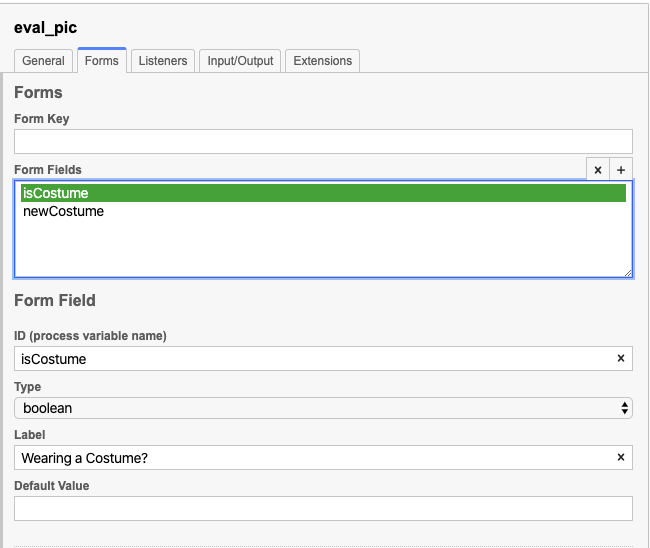
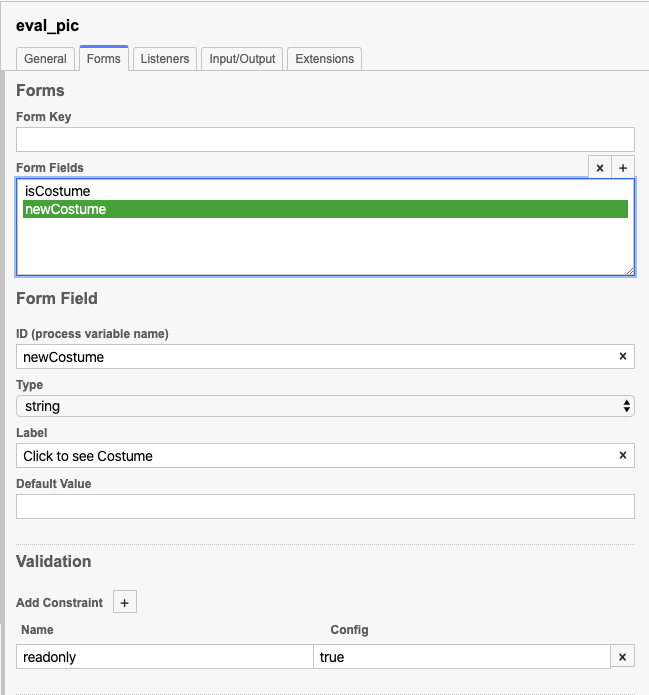

I made the `newCostume` field `readonly` so that users couldn't accidentally go to the
wrong picture.

_Area for improvement:_ Making the picture link in the form actually
clickable rather than having the user copy/paste the link into a new browser window.

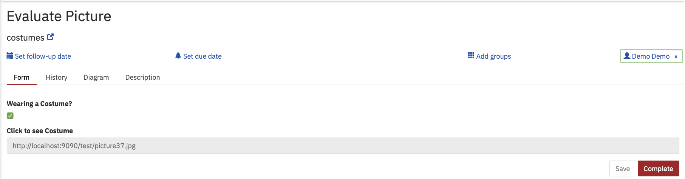

The process then adds a single piece of candy to the virtual candy bag, and for this
I used a Script Task with a small bit of javascript code:

```javascript
var candy = execution.getVariable('candyPieces');
if(candy == null){
   candy = 0;
}
candy += 1;
execution.setVariable('candyPieces', candy);
```


I'm using the global `candyPieces` variable that we set way back in the web server code
to keep track of the amount of candy.

Once we've done that, it's time to Rate the Costume, so I made another form:

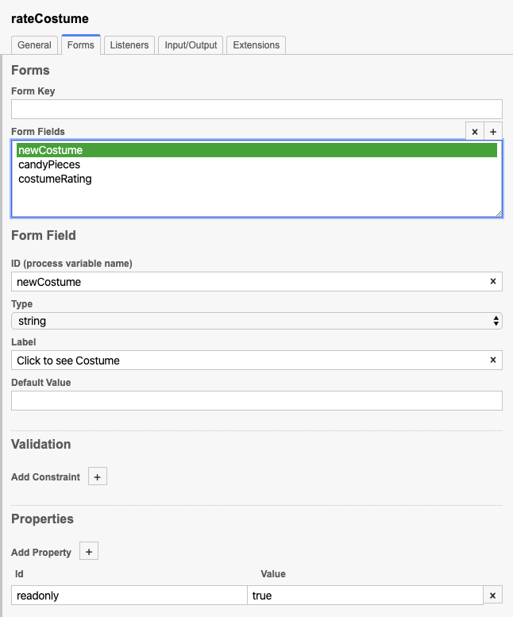
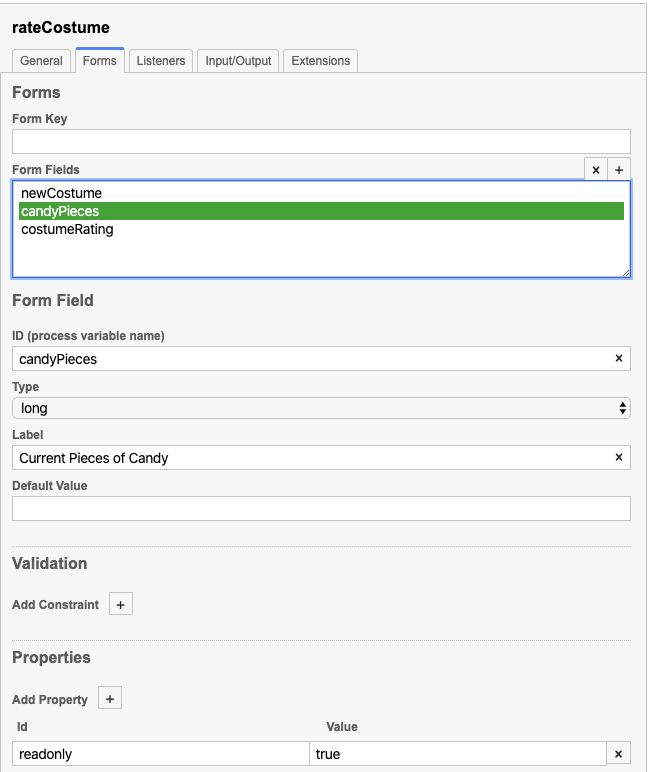
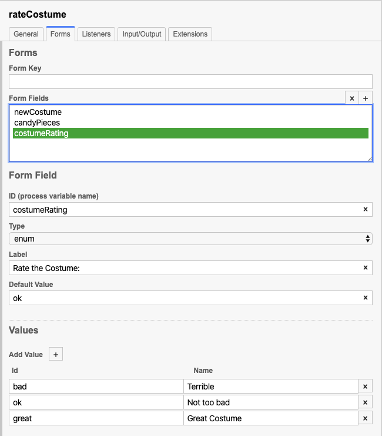

Again, the number of pieces of candy is not editable, because we don't want anyone cheating!

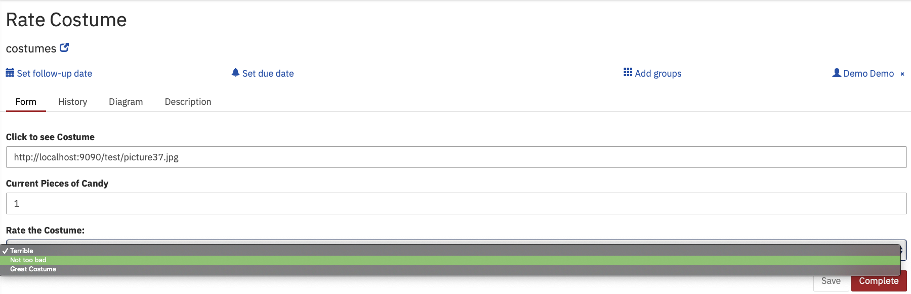

After this I needed to add more candy to the count (maybe, unless they had a
terrible costume) so I re-used the javascript code from the first Script Task for
all of the rest of them, just adjusting the amount (if any) of candy to be added.

And finally we estimate the Trick-or-Treater's age:

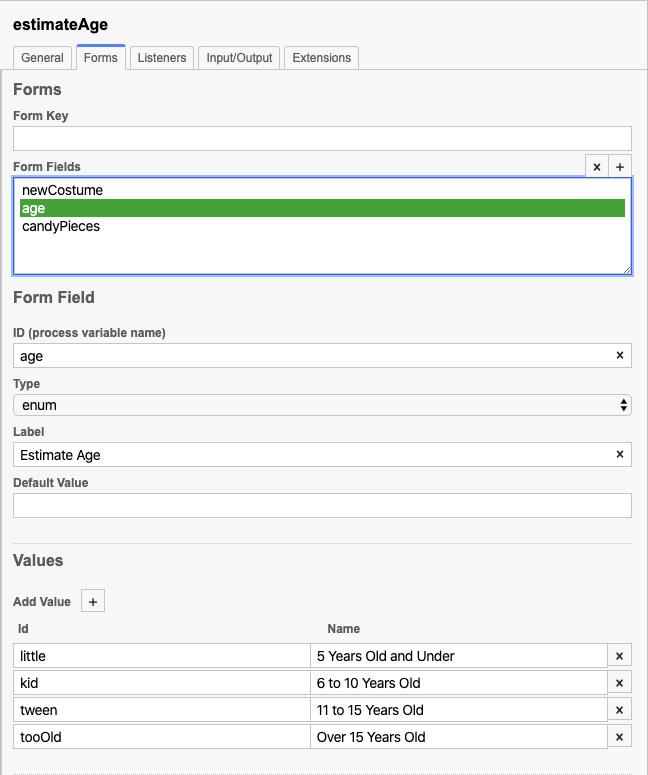

Which turns into a nice form:

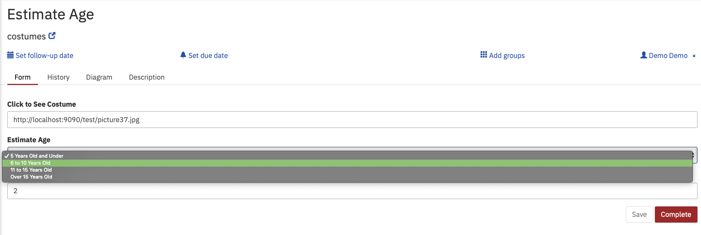

And once again re-use the javascript for the Script Tasks to add candy to the
candy bag.

The final step is to send the whole thing off to the worker task we defined earlier:

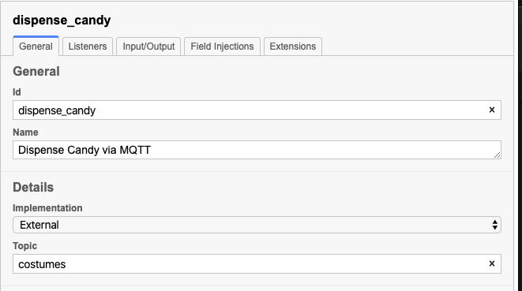

Notice that I set the `topic` to the same thing as I defined as my `topic` in the
`worker.js` file previously. When a task is completed, you should see the
following in the console where you started that task:

```bash
% node ./worker.js
✓ subscribed to topic costumes
Dispensing 4 pieces of candy!
✓ completed task ca3ae72e-1875-11eb-82d1-0242ac110002
```

Which indicates that the candy was dispensed, and the task was completed!

Success!!

## Conclusions

I was asked more than a few times how BPMN and IoT could ever be a 'thing' together,
and I was fully prepared for the answer to be "it can't".

But then I got to thinking about it -- there are actually thousands of ways in
which IoT data from sensors, etc. can be key pieces of data in a business decision-making
process.

In addition, having the ultimate outcome of a business-decision-making process be something
that is then carried out in the physical world -- maybe it's a treat dispenser, but
maybe it's a warehouse robot that is tasked to go collect and process an order -- is a
very real need.

So while I may have proven that BPMN and IoT can go together in the very dumbest way
possible, it was a super fun project, and I hope it gets you thinking about other
possibilities either for you IoT project, or for your BPMN processes.


